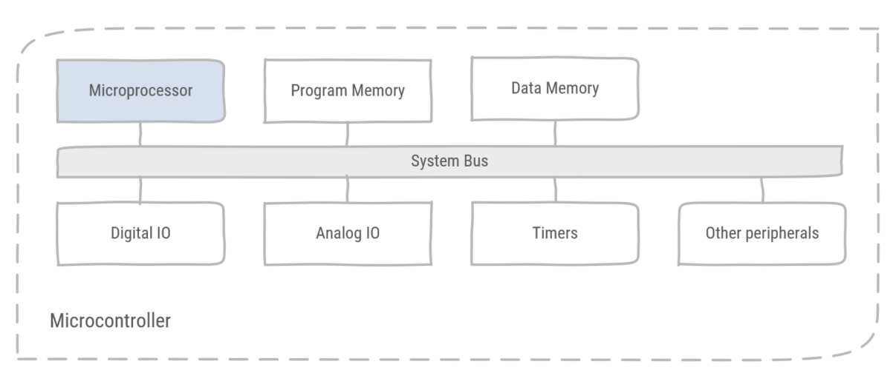

# Microcontrollers

> * What is the difference between a microcontroller and a microprocessor?
> * What is a 32-bit architecture?
> * What is the program counter?
> * What is the Stack & the Heap?
> * What are typical constraints of an embedded system?

## Embedded systems

Embedded systems are electronic systems which perform a dedicated task. They consist typically of microprocessors, microcontrollers, ASICs or FPGAs. Typically an embedded system forms the intelligence of a machine, i.e. it makes everything *smart*.

For economic reasons, embedded systems tend to be fit for purpose. This means they cannot cost more than they should to perform their task. These systems are typically limited in

* Available memory
* Limited processing capabilities
* In case of battery powered systems, limited energy
* Or real-time constraints, where missing a deadline might effectively cause harm.

## Microprocessor

A microprocessor is an electronic integrated circuit which consists of the Arithmetic and Logic Unit (ALU), registers, instruction fetch & decode circuitry and a memory interface.


Figure 1: a simplified microprocessor block schematic.

* Arithmetic and Logic Unit
  * Executes instructions on operands which are stored in the registers, and storing the result of its instruction in those registers.
  * These instructions are addition, multiplication, AND, OR, moving data in registers, shifting bits, loading literals in registers etc.
* The memory interface is the electronic circuitry which provides communication, i.e. control, clock & data signals, towards the memory banks.
  * Data memory contains program data, the stack & the heap. Stack and heap are regions in memory with special rules.
  * Program memory contains the program binary, i.e. the program instructions.
* Instruction fetch is electronic circuitry which fetches the next instruction to execute from the program memory.
* The instruction decoder translates the instruction word in electric signals which drive the ALU and selects the required registers.

::: tip Harvard vs. Princeton / von Neumann
In a Princeton (von Neumann) architecture, data and program memory are shared on a single memory. In a Harvard architecture data and program memory are separate memories. While the Harvard architecture is more complex and requires more busses, it performs better than the Princeton architecture. This is due to the *von Neumann* bottleneck, as data and program have to share the available bandwidth of the bus.


Figure 2: The Harvard architecture separates program from data memory. The Princeton architecture combines program and data in a single memory.

:::

::: tip Assembler & opcodes

While programmers use a high-level programming language to describe which instructions should be executed, the microprocessor uses a low-level binary translation of these instructions, called opcodes. The tool which translates high-level instructions to low-level opcodes is called a compiler. However, opcodes have a human-readable form called assembler.

An example is the [ARM assembler instruction set](http://infocenter.arm.com/help/topic/com.arm.doc.qrc0001l/QRC0001_UAL.pdf):

High level code

```cpp
int profit, revenue , expenses;
profit = revenue - expenses;
```

translated into assembler

```asm
  SUB r2, r1, r0
```

with the corresponding opcode

```text
f74f 5243 
```

:::

* Registers are very fast volatile memory storage and they contain the input and output of instructions. There is a difference between general purpose registers, which can be used for any instruction, and special purpose registers such as the program counter, link register and stack pointer.

:::tip x-bit architecture

A common way to classify microprocessors and microcontrollers is to refer to the architecture as a x-bit architecture, for instance 32-bit architecture, or 64-bit architecture. The number of bits in an architecture refers to the size of the registers. So, a 32-bit architecture has registers containing 32 bits.

All ARM processors have a 32 bits or 64 bits architecture. Other processor vendors have smaller architectures, such as 8-bit or 16-bit microcontrollers, though these type of architectures are less popular, as they are typically less powerful. Namely operations on large numbers require multiple steps and the memory addressing range is limited by the number of bits representing an address.
:::

* The program counter is a register containing the memory address of the next instruction to be executed. In normal operation the program counter is incremented, thus selecting the next instruction in program memory. However, sometimes the program needs to perform a jump to another instruction. For instance, when executing an if-statement two instructions are potentially the next instruction to be executed:

    ```cpp
    if(x == 42)
    {
        //(1)
    }
    else
    {
        //(2)
    }
    ```

    If the variable x is equal to 42 the next instruction is (1). In the other case the next instruction is 2.

    Another example of a jump is a loop:

    ```cpp
    while(x == 42) // (1)
    { 
        // (2)
    }
    // (3)
    ```

    After performing the final instruction in the body of the while loop (2), the program counter has to jump back to check the loop condition (1), i.e. is variable x equal to 42?

    Finally executing a function call, makes the program counter jump to the memory address where the function has been defined.

     ```cpp
    void f (int x)//(1)
    { 
        //(2)
    }

    f(42); //(3)
    ```

    Upon calling the function f, the program counter jumps to the first instruction of the function body (2).

## Microcontroller

A microcontroller is an electronic integrated circuit which consists of a microprocessor, memory & peripherals.



Figure 3: A microcontroller is a microprocessor with memory and peripherals integrated on the same chip.

## Memory Map

The memory map is a set of addresses which defines the purpose of memory locations.


Figure 4: An example of a memory map. This is the address layout of the memory of a computer system.

* *Memory-mapped I/O* is the interface between peripherals and the processor. From the viewpoint of the processor it can only write to and read from memory. Therefore memory locations are mapped on registers in peripherals, for example the *mode* register in the GPIOA peripheral is mapped to address **0x4800 0000**.
* *Data memory* is organized in three sections:
  * **Static data** containing global variables and static variables.
  * **Stack** containing temporary data for local variables, parameter passing in function calls and previous program counter values.
  * **Heap** containing memory spaces that are dynamically reserved by function calls, for example **new** or **malloc()**.

    

    Figure 5: Memory organization of SRAM, containing the Stack, the Heap and static data.

* *Program memory* contains instructions and constant data.
* Interrupt vectors are memory locations which are predefined addresses to which the program counter can jump to when receiving a specific signal. For instance the reset vector is the first memory address loaded in the program counter after a power cycle, i.e. a reset.

::: tip Big-Endian and Little-Endian


Figure 6: Big Endian vs. Little Endian.

Memory is organized so that each byte is addressable. This means that each individual byte has its own address. When a word (32-bit value) is fetched from memory, individual bytes can be organized in the register in two ways. The Most Significant Byte can be found on the lowest address of the word, this system is called Big-Endian. Little-Endian had the Least Significant Byte on the lowest address of the word.
:::

### Stack

The stack is a data memory region where data is stored according to a specific set of rules, i.e. the stack discipline.


Figure 7: On the Stack, frames are pushed onto the Stack and popped from the Stack in a Last In First Out order (LIFO).

The stack is organized in consecutive frames. Adding a frame is called pushing a frame on the stack. Removing a frame is called popping a frame. Frames are always pushed to or popped from the top of the stack. Therefore the stack is a so-called LIFO (Last In First Out) data structure. A frame is pushed when a function is called. At the end of the function the frame is popped. The active frame contains the execution context of the caller. This means that all local variables of the caller function are stored in the frame. When the callee is finished it restores the execution context of the caller.


Figure 8: Each function call, executing another function call, receives its own frame on the stack to store its execution context. These are the local variables stored in registers, call parameters and the function's return address.

Recursive functions, i.e. a function which calls itself, get their own stack frame each time the function is called.
