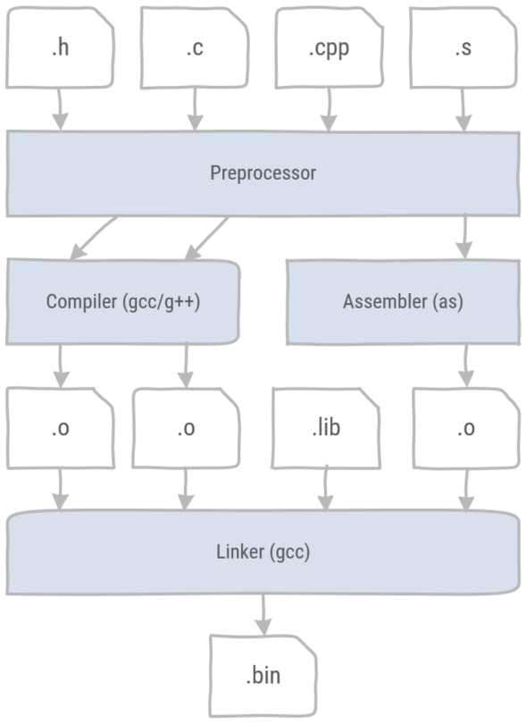
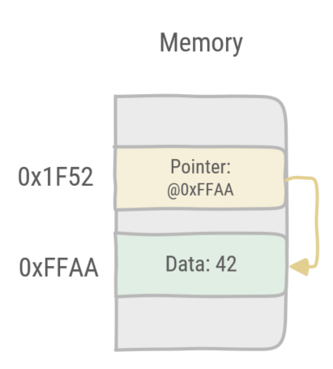
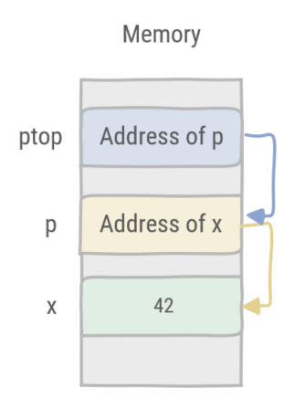
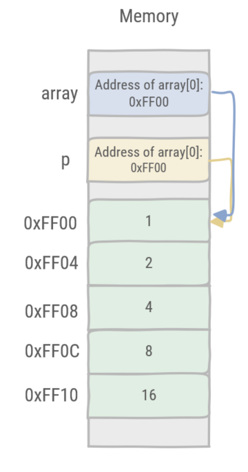

# Programming

> * What are the steps in the compilation process of a C/C++ project?
> * What is the advantage of using fixed size types?
> * How can you manipulate variables at the bit level?
> * What is a pointer?
> * How can you use pointers?
> * What does it mean to pass something by value or by reference?

C is the most popular language to develop embedded software. C++ is often considered a superset of C, but this is not strictly true.
However, a subset of C++ can be used to write efficient and safe embedded software. Many C++ compilers support microcontroller architectures, for instance the [GNU Arm Embedded toolchain](https://developer.arm.com/tools-and-software/open-source-software/developer-tools/gnu-toolchain/gnu-rm) contains the arm-none-eabi-g++ compiler, an open source C++ compiler for ARM Cortex M and ARM Cortex R targets.

## Compiler toolchain

To understand building C/C++ projects, it is necessary to learn about the different tools in the compilation toolchain.



Figure 1: The C/C++ compiler toolchain consists of the preprocessor, the compiler, the assembler and the linker.

1. Source files can be categorized by file extension.
    * Header (.h) files are files containing declarations for C or C++ source files. These are typically included in the source files with the **#include** directive.
    * Source (.c and .cpp) files are the source code files for C and C++ respectively. Note that C++ files might have different file extensions.
    * Assembler (.s) files are files containing assembler code. Note that assembler files might have different file extensions.
2. All files are preprocessed by the preprocessor. This is a tool which does copy/paste as instructed by the preprocessor directives. For example the **#include** directive literally copy and pastes a file into the place where the directive is found. Other useful directives are **#define**, **#ifdef #endif**, **#ifndef #endif**.
    * **#define** sets a preprocessor variable in a source file. These variables can also be be included in the compilation command.
    * **#ifdef #endif** defines a preprocessor block which is only included if the preprocessor variable has been defined.
    * **#ifndef #endif** defines a preprocessor block which is only included if the preprocessor variable has not been defined.

    These directives are typically included as a guard for header files. To use declarations in different source files, headers can be included multiple times. As the **include** directive performs a copy/paste operation including a header file multiple times, will result in multiple declarations errors. The following code snippet defines a block which can only be included once in the compilation process.

    ```cpp
    //start of the .h file
    #ifndef NAME_OF_HEADER_FILE
    #define NAME_OF_HEADER_FILE

    // header file declarations

    #endif
    //end of file
    ```

3. The compiler or assembler translates the human readable code which has been preprocessed to produce binary files called object files (.o). For each source files a corresponding object file is created.
4. The linker then takes all object files, including any pregenerated library files (.lib) and merges them into a single binary (.bin) file. Note that file extensions can differ. Actually when referring to a function in a source file, the compiler leaves the address of the function blank, until the linker decides where to put all the code. It then generates the correct addresses for the function calls.

::: tip
C/C++ does not specify the exact size of integer variable types. For example, a C/C++ **int** should be at least 16 bits. It can be larger. Also integer types are by default signed. The **unsigned** keyword is used to indicate an unsigned integer value.

In order to avoid confusion use the specific width integral type aliases from the header **stdint.h**. Note: **stdint.h** is included in **mbed.h**.

Table 1: standard integer types

| Signed integer | Unsigned Integer | Width |
| --- | --- | --- |
| int8_t | uint8_t | 8 bits |
| int16_t | uint16_t | 16 bits |
| int32_t | uint32_t | 32 bits |
| int64_t | uint64_t | 64 bits |

An example:

```cpp
#include "stdint.h"

int main() 
{
    uint32_t value = 42;
}
```

:::

## Bit Manipulation

Dealing with registers, bits are often set, cleared, toggled and shifted. C/C++ does not offer a *bit* data type, however it is possible to perform these tasks using bitwise operations.

### Masking

Given a value, a binary operation is applied with a certain bit mask. The bit mask is used to select which bits should be affected by the binary operation and which not. In the following examples the value is ```0b1010 0101``` and the mask is ```0b1111 0000```.

* Bitwise AND **&** is used for selecting bits in a word and clearing bits. Every *0* in the mask clears the corresponding bit in the resulting value. Every *1* in the mask keeps the current value of the corresponding bit. An example:

    ```cpp
      0b1010 0101
      0b1111 0000
    & -----------
      0b1010 0000
    ```

* Bitwise OR **|** is used for merging bits in a word and setting bits. Every *1* in the mask sets the corresponding bit in the resulting value. Every *0* in the mask does not affect the corresponding bit in the resulting value. An example:

    ```cpp
      0b1010 0101
      0b1111 0000
    | -----------
      0b1111 0101
    ```

* Bitwise NOT **~** is used for the one's complement of a word. All bits are inverted. An example:

    ```cpp
      0b1010 0101
    ~ -----------
      0b0101 1010
    ```

* Bitwise XOR **^** is used for toggling bits in a word. A *1* bit in the mask toggles the corresponding bit in the resulting value. A *0* bit in the mask does not affect the resulting value. An example:

    ```cpp
      0b1010 0101
      0b1111 0000
    ^ -----------
      0b0101 0101
    ```

### Shifting

A barrel shifter manipulates the position of the bits in a register. Bits are shifted left or right through the register, and *0* is shifted in the free positions.

* Right shift **>>** is used for shifting bits and division by a power of 2. An example:
  
    ```cpp
      uint8_t value = 0b1010 0101;
      uint8_t result = value >> 2;
      //result == 0b0010 1001;       
    ```

* Left shift **<<** is used for shifting bits and multiply by a power of 2.

    ```cpp
      uint8_t value = 0b1010 0101;
      uint8_t result = value << 1;
      //result == 0b0100 1010;       
    ```

## Pointers

A pointer is a variable which represents a memory address.



Figure 2: In this example the pointer points at the data at memory address 0xFFAA.

### Pointer syntax

* A pointer is declared by adding an *asterisk* to the type the pointer should point at. ```uint32_t *p;``` is a pointer pointing at an unsigned 32 bit variable.
* The address of a variable is retrieved by prefixing the variable with the reference operator, an *ampersand*. ```&x``` retrieves the address of the **x** variable.
* Retrieving the value pointed at by a pointer, is done with the dereference operator, an *asterisk*. ```*p``` retrieves the value pointed at by pointer **p**.

An example:

```cpp
#include <iostream>
#include "stdint.h"
using namespace std;
int main() 
{
    //declaration of x, an 32-bit unsigned integer variable
    uint32_t x = 42;
    
    //declaration of p, a pointer to an 32-bit unsigned integer variable
    uint32_t *p; 
    
    //assigning the address of x to p
    p = &x;
    
    //printing the value of x to the stdout stream
    cout << "value x: " << x << "\n";

    //dereferencing the pointer 
    //i.e. retrieving the value pointed at by the pointer and assign it to y
    uint32_t y = *p;
    cout << "value y: " << y << "\n";

    //printing the value of the pointer, i.e. the address of variable x  
    cout << "pointer: " << p << "\n";
    
    return 0;
}
```

::: tip
Pointers can point to pointers. An example:

```cpp
//variable x
uint32_t x = 42;
//pointer p points to x
uint32_t *p = &x;
//pointer ptop points to p 
uint32_t **ptop = &p;

//dereferencing twice
cout << "value: " << **ptop << "\n";
```



Figure 3: Pointer **ptop** points to pointer **p** which in turn points to the variable **x**.
:::

### Function parameters: by value or by reference

The default function calling convention in C/C++ is by value. This means the parameter of a function contains a copy of the variable value upon calling the function. When the function returns the original variable remains unchanged.

An example:

```cpp
/**
  *  Squares x
  *  @param x as a value 
  **/
void square(int32_t x)
{
    x = x * x;  
}

int main() 
{
    
    uint32_t x = 4;
    square(x);

    cout << "value: " << x << "\n"; //prints 4
    
    return 0;
}
```

In order to change the variable which is used as paramter, it must be passed to the function by using the reference operator **&**.

An example:

```cpp
/**
  *  Squares x
  *  @param x as a reference 
  **/
void square(int32_t &x)
{
    x = x * x;  
}

int main() 
{
    
    int32_t x = 4;
    
    square(x);

    cout << "value: " << x << "\n"; //prints 16
    
    return 0;
}
```

::: warning
By default pointers are passed by value, i.e. the pointer is copied as a parameter. However dereferencing the pointer in a function will change the value pointed to.

```cpp
/**
  *  Squares the value pointed by x
  *  @param x as a pointer 
  **/
void square(int32_t *x)
{
    //dereference x and assign to v
    int v = *x;
    v = v * v;
    //assign the result to the variable pointed at by x
    *x = v;
}

int main() 
{
    
    int32_t x = 4;
    
    //call square with the address of x
    square(&x);

    cout << "value: " << x << "\n"; //prints 16
    
    return 0;
}
```

:::

### C/C++ arrays

In C/C++ arrays are equivalent to pointers. Arrays are contiguous regions in memory. The pointer is the address of the first index in the array. Indexing into an array corresponds with giving an offset to the pointer, i.e. memory address, and dereference that address, thus retrieving the value at the index in the array.

An example:

```cpp
#include <iostream>
#include "stdint.h"
using namespace std;

int main() 
{

    int32_t array[] = {1, 2, 4, 8, 16};

    int32_t *p = array;

    cout << "value at position 2: " << array[2] << "\n"; //prints 4
    cout << "value pointed at by p: " << *p << "\n"; // prints 1
    cout << "value pointed at by p+2: " << *(p+2) << "\n"; // prints 4

    return 0;
}
```



Figure 4: Pointer p is identical to the array. The address is calculated by offsetting from the start of the array.

## Classes

C++ supports classes. In this course the focus is limited to using classes rather than defining them.

In the subsequent examples the [DigitalOut](https://os.mbed.com/docs/mbed-os/v6.15/apis/digitalout.html) class of the Mbed library is used. A led object is created and a method is called to turn it on. However there are three possible places in memory where the object is stored and this will affect the way the objects are dealt with.

Objects are created with a storage duration, depending on the context where they are created. The compiler will then place the object in the corresponding memory region. This also impacts how object's lifetime is managed. Table 2 shows the three possibilities.

Table 2: storage duration, memory location & lifetime management

| Storage duration | Memory location | Lifetime management |
| --- | --- | --- |
| Static storage | Static Memory | Global variable |
| Automatic storage | the Stack | Lives by the stack frame |
| Dynamic storage | the Heap | Manual call of the destructor |

In the first example the constructor creates a led object as a global variable. The led object is created in static memory and is never cleaned up.

```cpp

#include "mbed.h"

// Calls the constructor and creates the 'led' object in Static memory
DigitalOut led(LED1);

int main()
{    
    // Call the method write on the led object
    led.write(1);
}

```

In the second example the constructor creates a led object with automatic storage. The led object is created on the current stack frame and its destructor is automatically called when the stack frame is popped.

```cpp

#include "mbed.h"

int main()
{   
    // Calls the constructor and creates the 'led' object in the main Stack frame
    DigitalOut led(LED1); 
    // Call the method write on the led object
    led.write(1);
}

```

In the third example the constructor creates a led object with dynamic storage. The led object is created on the Heap and its destructor has to be manually called.

```cpp

#include "mbed.h"

int main()
{   
    // Calls the constructor and creates the 'led' object on the heap. 
    // Note that the led variable is a pointer to a DigitalOut object
    DigitalOut* led = new DigitalOut(LED1); 
    
    // Calls the method write on the led object requires the arrow operator 
    // rather than the dot operator, because led is a pointer. 
    // (*led).write(1); is the equivalent statement. 
    // First dereferencing the pointer and then calling the method. 
    // The arrow operator is a shorthand notation to do this.
    led->write(1);    

    // Calls the destructor
    delete led;
}

```

:::warning

Creating an object with the **new** keyword always requires a statement where **delete** is called on the object. Otherwise the program will have a memory leak.

:::

## Minimal main function

```cpp
int main(void) {
    return 0;
}
```

## Bit manipulation

## Setting a bit

Use the bitwise OR operator (|) to set a bit.

```cpp
number |= 1UL << n;
```

That will set the nth bit of number. n should be zero, if you want to set the 1st bit and so on upto n-1, if you want to set the nth bit.

Use 1ULL if number is wider than unsigned long; promotion of 1UL << n doesn't happen until after evaluating 1UL << n where it's undefined behaviour to shift by more than the width of a long. The same applies to all the rest of the examples.

## Clearing a bit

Use the bitwise AND operator (&) to clear a bit.

```cpp
number &= ~(1UL << n);
```

That will clear the nth bit of number. You must invert the bit string with the bitwise NOT operator (~), then AND it.

## Toggling a bit

The XOR operator (^) can be used to toggle a bit.

```cpp
number ^= 1UL << n;
```

That will toggle the nth bit of number.

## Checking a bit

You didn't ask for this, but I might as well add it.

To check a bit, shift the number n to the right, then bitwise AND it:

```cpp
bit = (number >> n) & 1U;
```

That will put the value of the nth bit of number into the variable bit.

## Changing the nth bit to x

Setting the nth bit to either 1 or 0 can be achieved with the following on a 2's complement C++ implementation:

```cpp
number ^= (-x ^ number) & (1UL << n);
```

Bit n will be set if x is 1, and cleared if x is 0. If x has some other value, you get garbage. x = !!x will booleanize it to 0 or 1.

To make this independent of 2's complement negation behaviour (where -1 has all bits set, unlike on a 1's complement or sign/magnitude C++ implementation), use unsigned negation.

```cpp
number ^= (-(unsigned long)x ^ number) & (1UL << n);
```

or

```cpp
unsigned long newbit = !!x;    // Also booleanize to force 0 or 1
number ^= (-newbit ^ number) & (1UL << n);
```

It's generally a good idea to use unsigned types for portable bit manipulation.

or

```cpp
number = (number & ~(1UL << n)) | (x << n);
```

(number & ~(1UL << n)) will clear the nth bit and (x << n) will set the nth bit to x.

### Macros

```cpp
/* a=target variable, b=bit number to act upon 0-n */
#define BIT_SET(a,b) ((a) |= (1ULL<<(b)))
#define BIT_CLEAR(a,b) ((a) &= ~(1ULL<<(b)))
#define BIT_FLIP(a,b) ((a) ^= (1ULL<<(b)))
#define BIT_CHECK(a,b) (!!((a) & (1ULL<<(b))))        // '!!' to make sure this returns 0 or 1
```

## stdint.h

* `uint8_t`
* `uint16_t`
* `uint32_t`

```cpp
#include <stdint.h>

uint32_t counter = 0;

int main(void) {
    while(true) {
        counter++;
    }
    return 0;
}
```

## volatile
