# Programming microcontrollers

## Blinky

## STM32 Family

## Nucleo L476RG

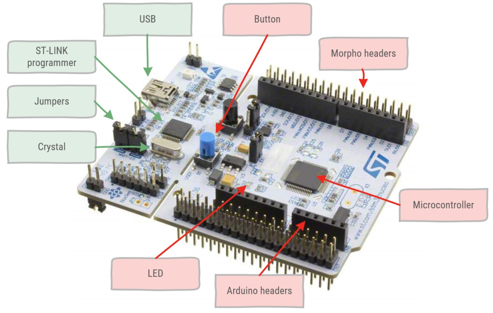

The microcontroller board actually consists of two microcontrollers. The ST-LINK (green labels) programmer microcontroller provides an on-board programmer module for the STM32L476RG microcontroller (red labels). More information can be found in the [UM1724 User Manual](https://www.st.com/content/st_com/en/products/evaluation-tools/product-evaluation-tools/mcu-mpu-eval-tools/stm32-mcu-mpu-eval-tools/stm32-nucleo-boards/nucleo-l476rg.html#resource)

* ST-LINK
  * Programmer: microcontroller providing USB communication to load the binary to the STM32L476RG microcontroller user flash. This is called In-System Programming. It also allows writing data into RAM. This allows for Serial Wire Debug (SWD). This is a protocol based on JTAG, a software/hardware interface for debugging.
  * USB: mini-USB interface.
  * Jumpers: are two or more pins which can be shorted by a jumper. These are used for hardware configuration settings. Connecting certain parts when a jumper is present or disconnecting them when the jumper is removed.
  * Crystal: Provides a clock signal for the programmer microcontroller.
* STM32L476RG
  * LED: SMD user LED (set as a digital output)
  * Button: joystick (used as a digital input)
  * Arduino headers: physical connection to pins which follows the Arduino layout.
  * Morpho headers: physical connection to pins which follows the Morpho layout.

I/O modules are mapped onto memory addresses, so that a given bit corresponds to the value on the physical pin Writing to or reading from these addresses corresponds to writing to or reading from the physical pins Physical pins are mapped onto ports: for instance PA_0 reads as port A pin 0.

Many pins are mapped onto multiple peripherals, for instance PA_0 is used for GPIO, Analog In, PWM2/1, Serial4 Tx. In a register the pin function is selected. A pin can only have 1 actual purpose. The reason is economical, frankly the cost of wiring a physical pin into a microcontroller chip is determinative for the total cost of the chip. Therefore multiple functions are mapped onto the same physical pins.

### Arduino Headers

The Nucleo development boards provide Arduino compatible headers. This enables you to use most of the Arduino shields that are available on the market. Just keep in mind that Nucleo boards use 3.3V power, while Arduino uses 5V power. A lot of boards and chips can be used on both voltages, but some might not. It is better to check the datasheets before connecting a shield.


### Morpho Headers

Morpho headers provide much more pins to the user than the limited Arduino pin headers. If you need more or other pins from the STM32 microcontroller, an Morpho headers will provide it.

Morpho header shields are less available than the Arduino style sheets. Morpho is more exclusively used by STM.

Due to the misalignment of the Arduino headers, which became a trademark, it is not possible to use custom experimentation boards using the Arduino headers. Morpho headers use a normal alignment of 100mil or 2.54mm. This enables you to use experimentation boards on these headers.

::: warning Arduino & Morpho pin compatibility
All Arduino headers pins are also connected to the Morpho headers, in the same order. You have all the Arduino header pins available and much more.
:::


## Schematic

The [MB1136 schematics](https://www.st.com/content/st_com/en/products/evaluation-tools/product-evaluation-tools/mcu-mpu-eval-tools/stm32-mcu-mpu-eval-tools/stm32-nucleo-boards/nucleo-l476rg.html#resource) show the full schematic of a Nucleo64 board. The schematic is divided in different parts containing the circuits for the microcontroller, st-link programmer, headers, power and so on.

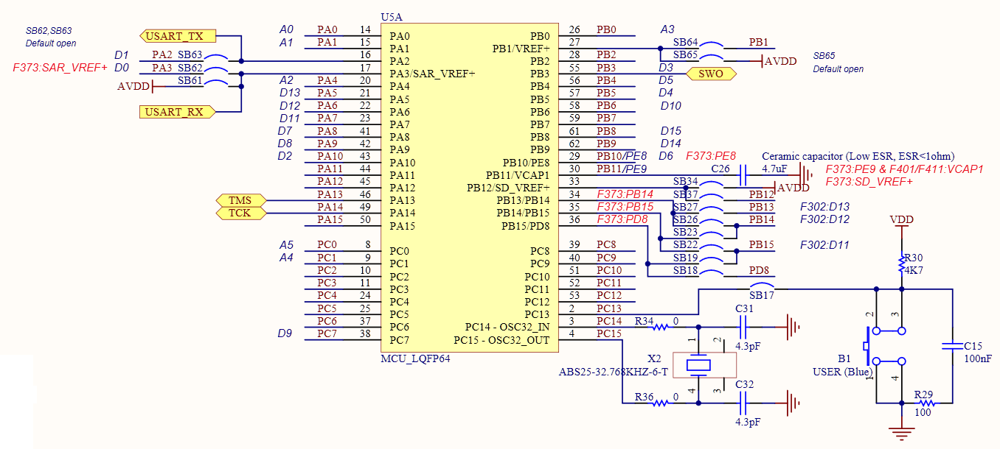

Here you can see the schematic functional pins (GPIO and others) of the microcontroller. You can see that all pins are named like `PA0`, `PC3`, `PB5` and so on. This naming scheme provides some information of the internal working a well.

The letter `P` denotes that the pin is connected to some port. The next letter denotes the port. ARM chips provide multiple *ports* such as Port A, Port B,... The last characters, a number indicates the pin on that port.

Typically ports have each 16 pins. Not all of them might be available due to different pins on the package or different types.

::: tip Arduino and ARM Cortex pinnames
Some pins have an additional label, starting with the letter `A` or `D`. These labels are used on the Arduino headers. This enables you to quickly lookup the mapped Arduino pin to the ARM Cortex pin. Eg: Arduino pin `D7` is mapped to ARM Cortex pin`PA8`
:::

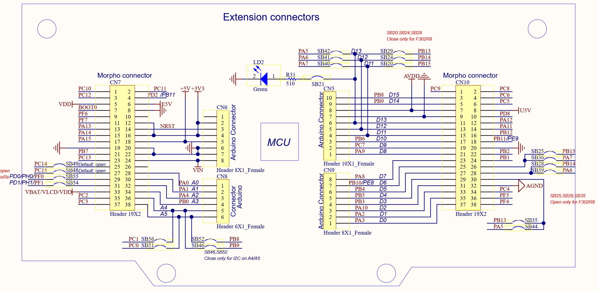

Here you can see the connections to the headers, and how the headers reuse the same pins of the microcontroller.

## The LED

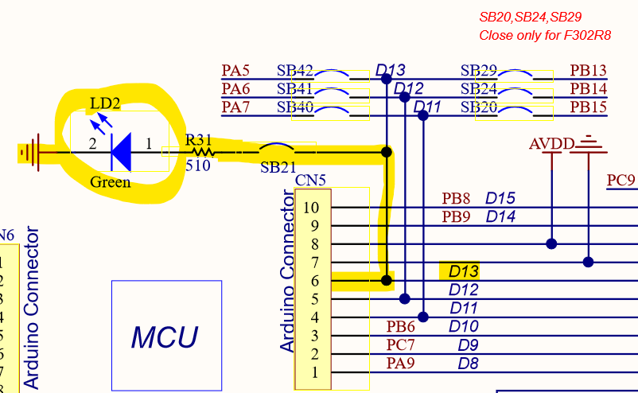

In the schematic we can see an Green LED. This LED can be controlled by the microcontroller. The schematic shows that de LED is connected using a series resistor R31 of 510 Ohms, and is connected to pin `D13`, which is intern mapped to pin `PA5`.

Lets try to toggle this led on and off by writing some code, and programming it to the microcontroller.

## Setting PA5 high and low

Lets take a look in the [STM32L476RG datasheet](https://www.st.com/resource/en/datasheet/stm32l476rg.pdf) (It might be helpfull to download this datasheet, as we are going to need it a lot).

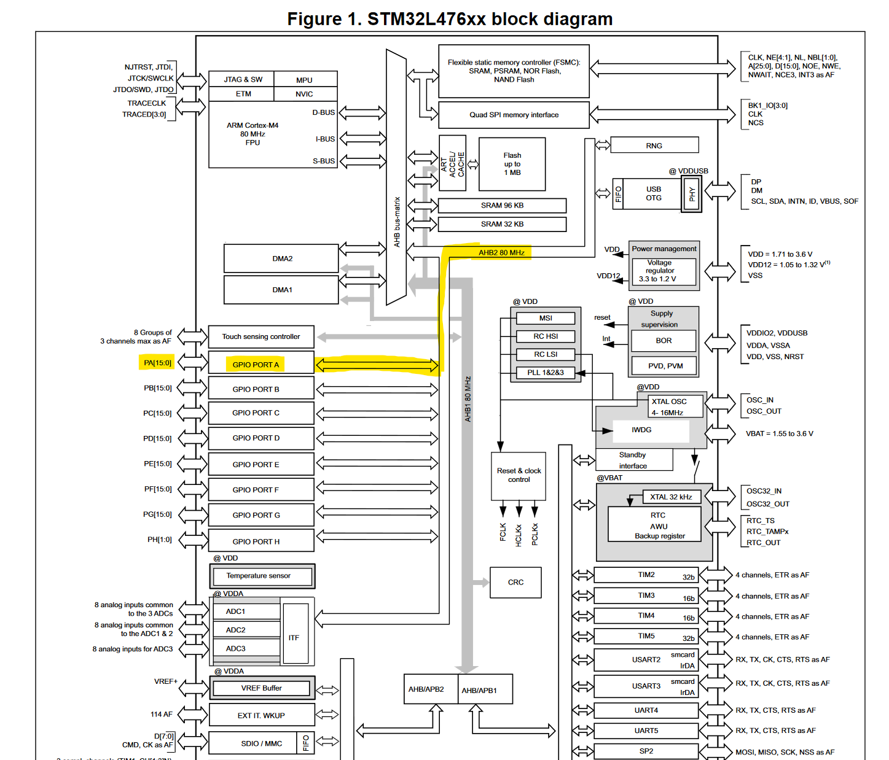

In the datasheet, on __Figure 1. STM32L476xx block diagram__ we can see that pin `PA5`, connected to `GPIO PORT A` is connected internally to the `AHB2` bus. AHB2 stans for *Advanced High-performance Bus* We need to enable this bus first in order to be able to change any settings on `GPIO PORT A`.

Details about how to enable the `AHB2` bus can be found in the [RM0351 Reference manual](https://www.st.com/content/ccc/resource/technical/document/reference_manual/02/35/09/0c/4f/f7/40/03/DM00083560.pdf/files/DM00083560.pdf/jcr:content/translations/en.DM00083560.pdf)

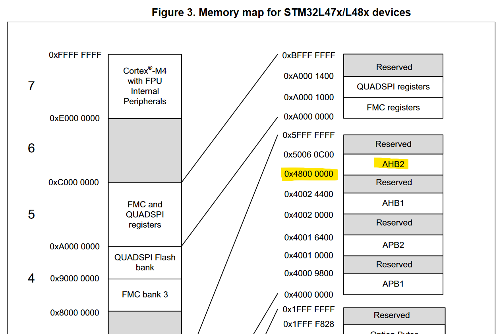

Remember, all we can do with a microcontroller is read and write to memory mapped *registers*. Let's take a look at __Figure 3. Memory map for STM32L47x/L48x devices__. This figure show a memory map of the microcontroller. Here we can see that the `AHB2` registers are mapped to `0x4800 0000`. Lets take a look at the details.

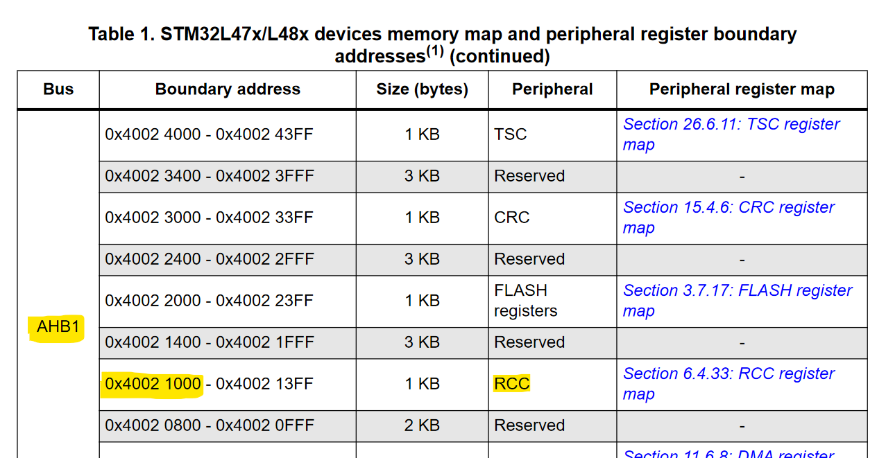

Digging a bit deeper in the reference manual, teaches us that we need to use the RCC (Reset and Clock Control) register in order to enable peripherals and clock after a reset is occured. All RCC registers are available at starting address `0x4002 1000`.

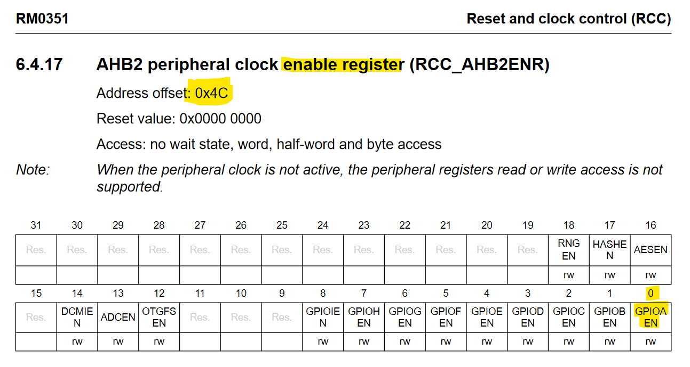

To enable `GPIO A` port we can use the `RCC_AHB2ENR` register (Reset and Clock Control, AHB2 Enable Register). This register allowes it to enable and disable the different peripherals that are available on the AHB2 bus. The `RCC_AHB2ENR` register is available at offset `0x4C`, meaning the full register address is `0x4802 104C`.

The register is a 32bit register. Bit 0 of the register is used to enable or disable the `GPIO A` port. Meaning that if we *set* this bit to a `1` value, `GPIO A` will be enabled and ready to be used.

In code, we could set bit 0 with the following code:

```cpp
(*(volatile uint32_t*)(0x40021000 + 0x4C)) |= 1;
```

Lets take a look at what this code means.

Now `GPIO A` port is enabled and ready to be used.

### GPIO's

In digital devices, logic values `1` or `0` are represented as electrical voltages. Different devices may use different voltages to represent a logic value.

Normally, the external pins are not directly accessible, but accessed via a peripheral called __General-Purpose Input/Output__ (GPIO). More information can be found in the RM0351 Reference Manual
(opens new window) chapter 8.

#### Pin modes

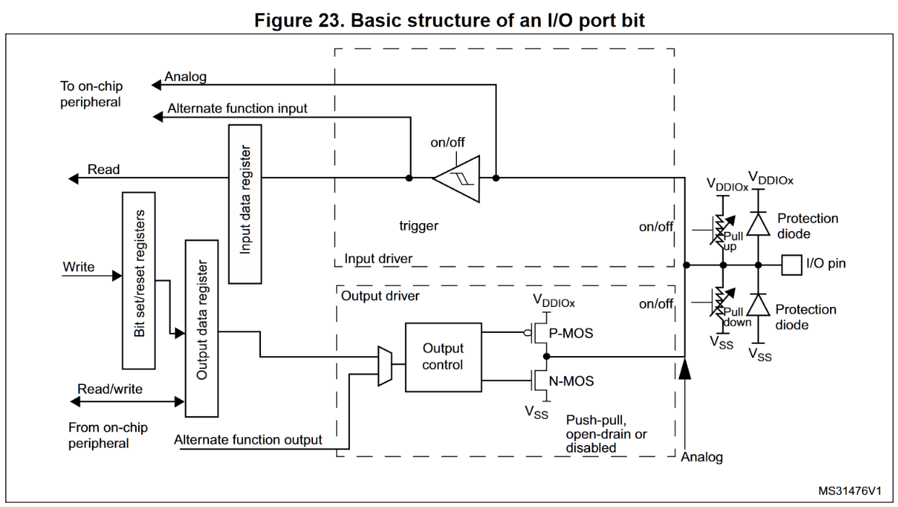

At the right, we can see the physical I/O pin that comes out of the chip as a pin.

* __Protection diodes__ provide protection against static electricity and other voltages that are not conforming the specifications. The protection diodes have a limited power that can be disipated. This means if you connect a wrong voltage to the pin, it can only protect the microcontroller within its power disipation range. A high voltage can be tolerated for a shor time. It all depends on the voltage, current and time.
* __Pull up__ and __pull down__ resistors. These resistors are implemented using mosfet technology, meaning that they can be enabled or disabled using logical signals. The state of these logic signals can be configured using *registers*.
* __Analog__ signal path that is used for analog signals.
* __Push-Pull__ output stage, containing a P-MOS and N-MOS mosfet. These mosfets can pull the voltage of the output to a high or low level. If both mosfets are not controlled, the output can be set into an high-impedance state.
* __Alternate functions__ can be used to give special functions to the pin, such as UART, SPI or I²C.
* __Digital input__ Opamp buffered digital signal converter that can read digital signaling.

All of these features can be configured and altered using __Registers__.

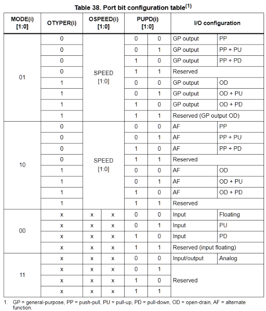

In our case we just want to use the pin as a __general purpose output__ in __push-pull__ configuration. This allows the pin to be set to VDD and VSS voltages (3.3V and 0V or ground). In order to set the pin in this configuration, Table 38 Port bit configuration table, dictates that we need to set the following properties

| Configuration | Value | Reset value | Register | Offset |
|---|---|---|---|---|
| Mode |  `01` |   `11` | MODE | `0x00` |
| Output Type |  `0` |  `0` | OTYPER | `0x04` |
| Output Speed |  `00` |  `00` | OSPEED | `0x08` |
| PullUp/PullDown |  `00` | `00` | PUPD | `0x0C` |

Remember, we are trying to configure Pin `5` of `GPIO A`.

We have some luck. *Output Type*, *Output Speed* and *PullUp/PullDown* values that we need, are already set in the needed configuration after reset. Thus we don't need to change them at the moment. Although it might be a good idea to set them in any case, just to be sure. For the simplicity of this example we will ignore them.

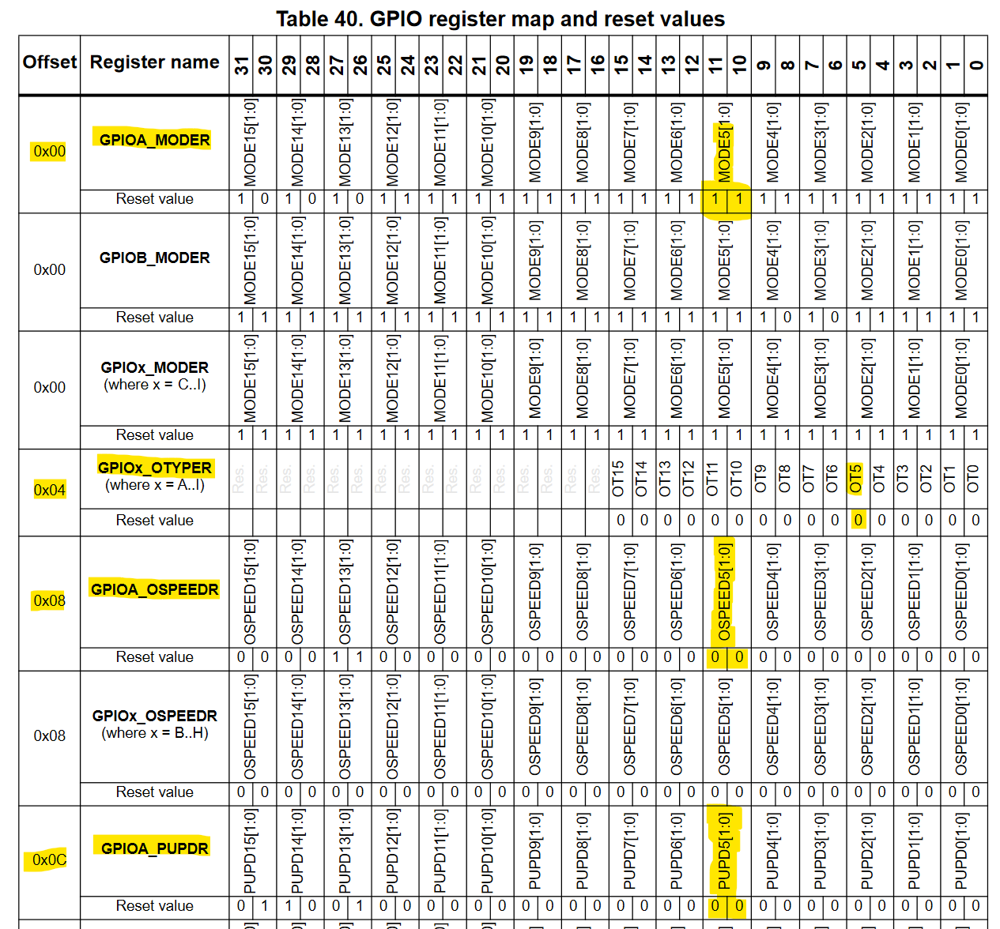

So lets change the Mode register in order to set `PA5` pin in the correct mode.

Table 1, shows us that the `GPIOA` peripheral registers start at address `0x4800 0000`. The `GPIOA_MODER` register is thus available at address `0x4800 0000` (remember, offset `0x00`).

The code to reset bit 11 and set bit 10 looks like this:

```cpp
(*(volatile uint32_t*)(0x48000000 + 0x00)) &= ~(1<<11);
(*(volatile uint32_t*)(0x48000000 + 0x00)) |= (1 << 10);
```

## Controlling the output

The `PA5` pin is now correctly configured to be used for driving the LED. Now lets turn the led on and off.

ARM Cortex microcontrollers provide registers in order to *set* and *reset* the output values.
This register is called the `BSRR` or `GPIOA_BSRR` register (Bit Set Reset Register) and lives at offset `0x18`.

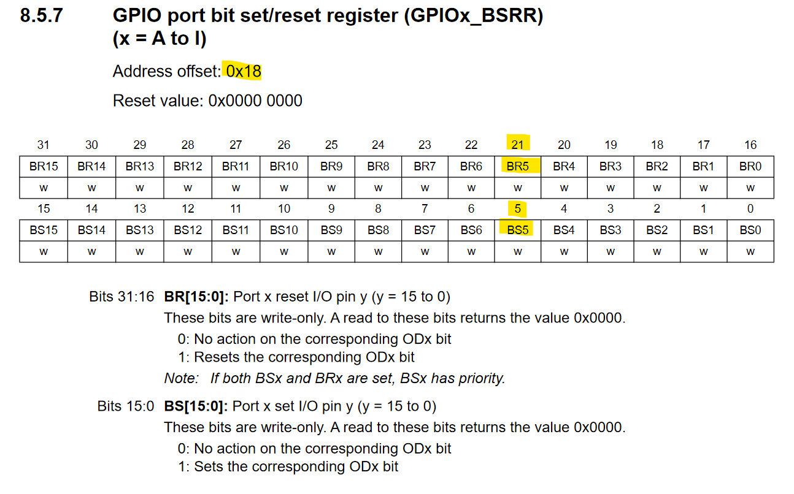

So in order to light up the LED we need to write a `1` to bit 5 of the `GPIOA_BSRR` register. To turn the LED back off, a `1` needs to be written to bit `21` of the `GPIOA_BSRR`register.

```cpp
// Bit Set pin 5
(*(volatile uint32_t*)(0x48000000 + 0x18)) |= 1 << 5;

// Bit Reset pin 5
(*(volatile uint32_t*)(0x48000000 + 0x18))  |= 1 << 21;
```

## Delays

Microcontrollers work at very high speeds. Turning a led on and off at multiple megahertz, won't show us anything. It will look like the led only is turned on and does not turn off.

It is thus needed to wait a little bit and insert a delay before turning the led back on or off.

The STM32L476RG runs at 80MHz, meaning that each instruction is executed in 12,5 nanoseconds. A Changing a register or variable contains at least an LOAD, update and STORE instruction. If we place this in an for-loop, around 10 clock cycles are needed just to repeat a `++` instruction.

```cpp
for(volatile uint32_t i = 0; i < 1; i++);
```

How many times should the loop be executed to get a delay of about 1 microsecond?

number iterations = 80.000.000 Hz / 10 instructions / 1000ms/S = 8000 iterations

So the following code would give a delay of around 1ms:

```cpp
for(volatile uint32_t i = 0; i < 8000; i++);
```

1ms is still way to fast to toggle the LED on and off. 500ms or 1/2 second, would be much better.
So the following code could be used to give a arbitrary delay in milliseconds:

```cpp
void approx_wait(uint32_t milliseconds)
{
    for (uint32_t j = 0; j < milliseconds; j++)
    {
        for(volatile uint32_t i = 0; i < 80 * 1000 / 10; i++);
    }
}
```

We can give an argument containing a number of milliseconds, the delay should take.

::: warning Assembler & opcodes
This is not an efficient way of waiting on a microcontroller. Timers should be used instead, but this is will be later explained.
:::

::: warning `volatile` keyword
The second for-loop contains the keyword `volatile`. This is due to the fact that this for-loop does not contain a body (using `{` and `}`). The compiler would notice this and think that the for-loop has no purpose. The compiler would optimize this loop away, resulting in a loop that is instantly executed without any delay.
:::

## Getting it all together

```cpp
#include <stdint.h>

void approx_wait(uint32_t milliseconds)
{
    for (uint32_t j = 0; j < milliseconds; j++)
    {
        for(volatile uint32_t i = 0; i < 80 * 1000 / 10; i++);
    }
}

int main() {
    (*(volatile uint32_t*)(0x40021000 + 0x4C)) |= 1;
    (*(volatile uint32_t*)(0x48000000 + 0x00)) &= ~(1<<11);
    (*(volatile uint32_t*)(0x48000000 + 0x00)) |= (1 << 10);

    while (true)
    {
        (*(volatile uint32_t*)(0x48000000 + 0x18)) |= 1 << 5;
        approx_wait(500);
        (*(volatile uint32_t*)(0x48000000 + 0x18))  |= 1 << 21;
        approx_wait(500);
    }
    return 0;
}
```
